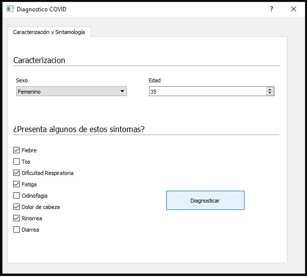

<h1 align="center">Aplicación desarrollada para el diagnóstico de Covid-19 con base en los síntomas de los pacientes</h1>
<p>
    Esta aplicación contiene la implementación de diferentes modelos de redes neuronales profundas para predecir la posibilidad de que un paciente padezca Covid-19 con base en los síntomas reportado. La interfaz de usuario se desarrolló utilizando Qt.
</p>

<p>

     Los modelos fueron entrenados con datos de pacientes que asistieron a consulta por padecer síntomas de Covid-19 al Hospital San Cristobal de Cíenaga - Magdalena, Colombia. Durante el entrenamiento y ajuste de parámetros de diferentes métodos de predicción que se evaluaron, basados en redes neuronales profundo, se llevó a cabo una selección automática de los síntomas mas relevantes para la predicción, los cuales se listan a continuación:
     
     Edad
     Sexo
     Tos
     Fiebre
     Dificultad respiratoria
     Fatiga
     Odinofagia
     Dolo de cabeza
     Rinorrea
     Diarrea

</p>

<p>
    En el desarrolllo de esta actividad se evaluaron diferentes modelos utilizando la plataforma H2O y su componente AutoML, que permiten automatizar la selección del modelo, la generación de características, el ajuste de parámetros y la evaluación de los diferentes modelos. Por defecto H2O y AutoML entrena y evalúa modelos utilizando los siguientes métodos:
Distributed Random Forest (DRF), Generalized Linear Model con regularización (GLM), modelos de redes neuronales con múltiples capas, completamente conectadas, y Extreme Gradient Boosting (XGBoost). Entre todos los modelos entrenados se seleccionón Gradient Boosting Machine (GBM) como el mejor predictor para la construcción de la aplicación final.
</p>

<h2>Para ejecutar la aplicación</h2>

<h3>Configuración de un ambiente virtual</h3>

```
    python3.8 -m venv <env_name>
```

<p>
    En Anaconda la configuración del ambiente virtual se puede realizar con la siguiente línea:
</p>

```
    conda create --name <env_name> python=3.8
```

<p>Active el ambiente vitual:<p>


```
    cd <env_name> \Scripts\activate.bat
```

<p>Anaconda:<p>

```
    conda activate <env_name>
```

<h3>Librerías necesarias para instalar</h3>


<p>
    Estas son algunas de las librerías que deberá instalar para la ejecución del programa:

    matplotlib
    numpy
    h2o
    openjdk
    pyqt
</p>


<h3>Desktop App: uso</h3>

<p>Ejecutando la aplicaciónp</p>


```
   python IntegrationCOVIDGUI.py
```

<div align="center">
    
</div>

<p> Introduzca el sexo, la edad y los síntomas presentes en el paciente, y presione el botón Diagnosticar.</p>

<div align="center">
    
</div>

<p> La aplicación tomará unos segundo en emitir un diagnóstico, al final presione el botón OK en la ventana emergente que contiene el resultado. El resultado mostrará un porcentaje de confianza de que la persona padezca de Covid-19</p>

<div align="center">
    
</div>

