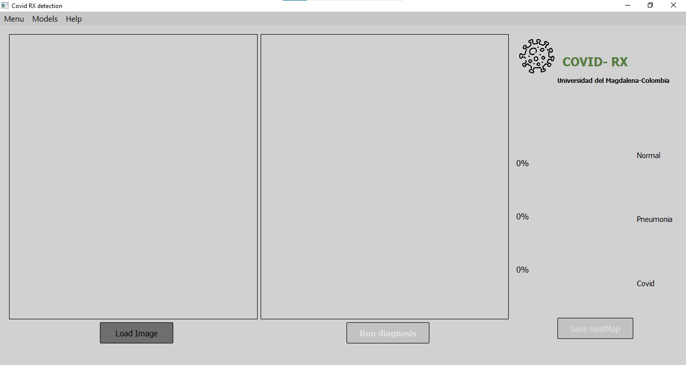
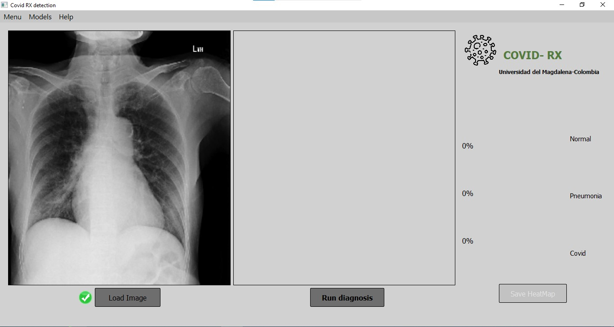
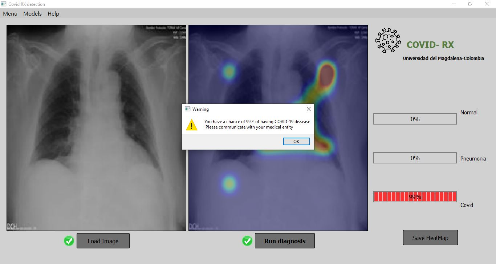
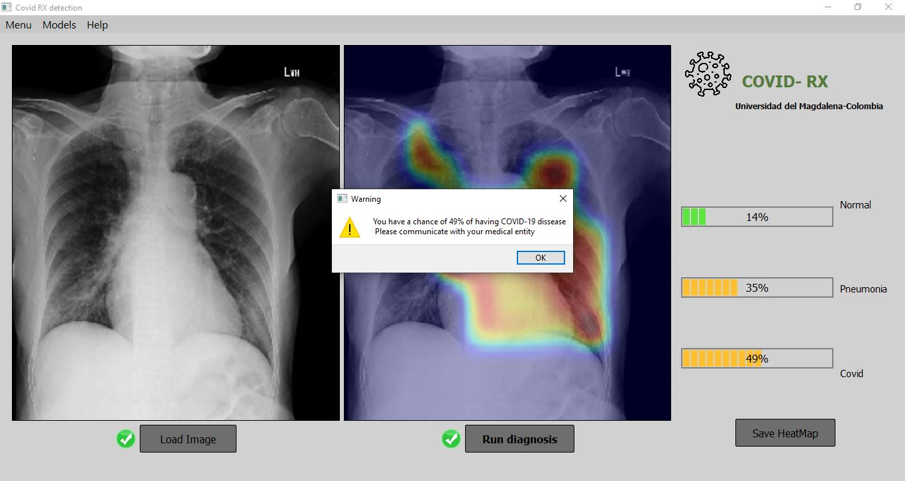
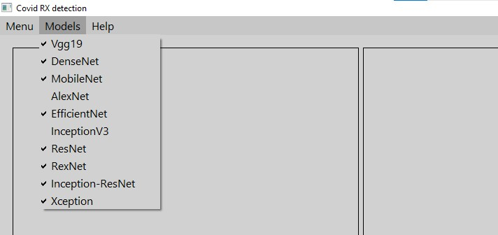
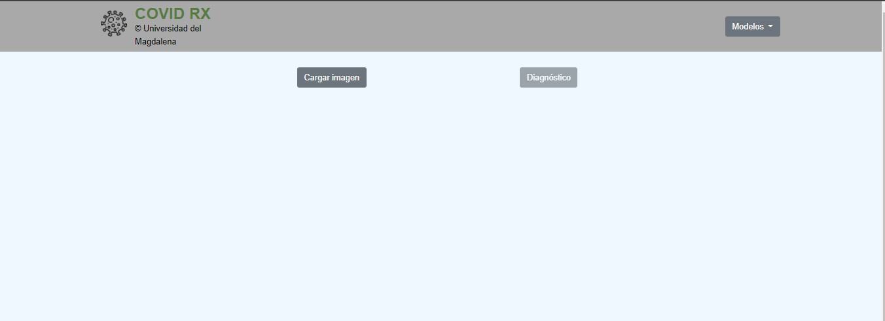
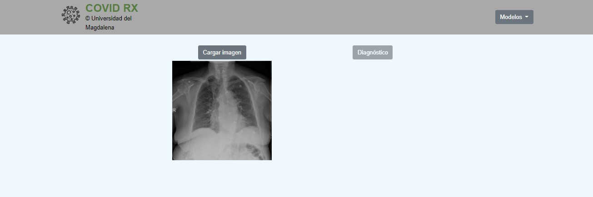
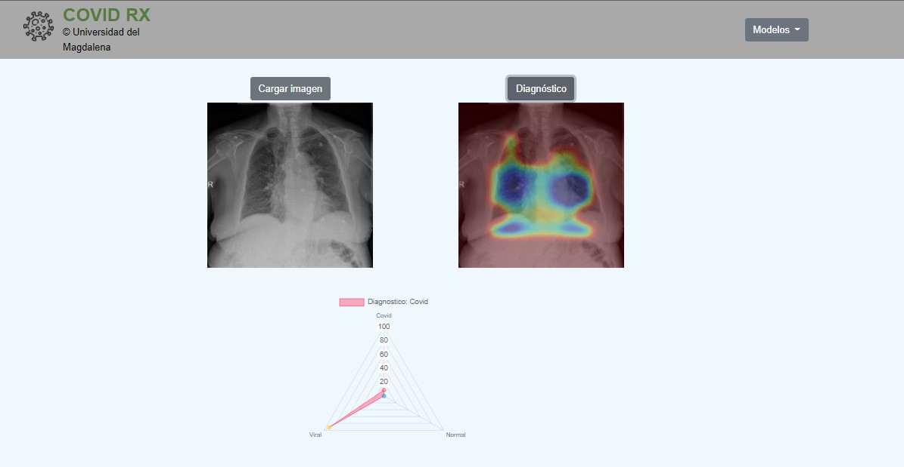

<h1 align="center">Aplicación desarrollada para el diagnóstico de Covid-19 con base en imagenes de rayos X del paciente</h1>
<p>
   Esta aplicación contiene la implementación de diferentes modelos de redes neuronales convolutivas para llevar a cabo el diagnóstico de pacientes con Covid-19, neumonía, o normal basados en imagenes de rayos X. La interfaz de usuario se desarrolló utilizando Qt.

</p>

<p>

Los modelos fueron entrenados con imagenes de ejemplos recopiladas de diferentes repositorios públicos, los cuales se listan a continuación:


https://github.com/samxmot/RANDGAN - Randomized Generative Adversarial Network for Detection of COVID-19 in Chest X-ray

https://github.com/jdariasl/COVIDNET - Artificial Intelligence applied to chest X-Ray images for the automatic detection of COVID-19. A thoughtful evaluation approach

https://github.com/ieee8023/covid-chestxray-dataset

https://www.kaggle.com/tawsifurrahman/covid19-radiography-database

https://www.kaggle.com/bachrr/covid-chest-xray

https://www.kaggle.com/paultimothymooney/chest-xray-pneumonia

https://github.com/IAM-CVC/CovAIR

https://academictorrents.com/details/557481faacd824c83fbf57dcf7b6da9383b3235a
</p>

<p>
    Los modelos entrenados fueron los siguientes: 

    Vgg19
    Densenet
    Mobilenet
    Alexnet
    Efficientnet
    InceptionV3
    Resnet
    Rexnet
    Inception_resnet
    Xception
</p>

<h2>Para ejecutar la aplicación</h2>

<h3>Configuración de un ambiente virtual</h3>

```
    python3.8 -m venv <env_name>
```

<p>
    En Anaconda la configuración del ambiente virtual se puede realizar con la siguiente línea:
</p>

```
    conda create --name <env_name> python=3.8
```

<p>Active el ambiente vitual:<p>


```
    cd <env_name> \Scripts\activate.bat
```

<p>Anaconda:<p>

```
    conda activate <env_name>
```

<h3>Librerías necesarias para instalar</h3>


<p>
  Estas son algunas de las librerías que deberá instalar para la ejecución del programa:

   matplotlib
   numpy
   opencv
   pyside2
   scipy
   timm
   torch
   torchvision
   torchcam
</p>


<h3>Desktop App: uso</h3>

<p>Ejecutando la aplicaciónp</p>


```
    cd src
    python app.py
```

<div align="center">
    
</div>

<p> Presione el botón Loas Image y seleccione la imagen del paciente que desea diagnosticar.</p>

<div align="center">
    
</div>

<p> Luego presione el botón Run Diagnosis. La aplicación tomará unos segundo en emitir un diagnóstico, al final presione el botón OK en la ventana emergente que contiene el resultado. También podrá observar diferentes porcentajes de confianza para Normal, Neumonía o Covid-19 en la parte derecha de la interfaz</p>

<div align="center">
    
</div>

<p> Además del diagnóstico la aplicación también genera un mapa de calor en el que se puede observar que zonas de la imagen del paciente activó las diferentes capas de los modelos de redes neuronales convolutivas implementadas. </p>


<div align="center">
    
</div>


<p> El mapa de calor generado por la herramienta se puede guardar presionando el botón Save HeatMap.</p>


<p> El diagnóstico está basado en 10 modelos de redes neuronales convolutivas que se encuentran listados en el menú Models, allí el usuario puede quitar la selección de algunos modelos en caso de que así lo desee.</p>
<div align="center">
    
</div>

<h3>web App: uso</h3>

<p>Ejecutando la Web app</p>

```
    cd src
    cd sites
    python webApp.py

```
<p> copy and paste the http://127.0.0.1:5000/ in any navigator of preference. </p>
<div align="center">
    
</div>

<p> Click load image, choose the image that you want to diagnose and click open. </p>

<div align="center">
    
</div>

<p> Click diagnosis and the algorithm will analyze the image. </p>
<div align="center">
    
</div>
<p>
it will display a heatmap of the diagnosis, and a plot with the distribution of probbility of being normal, pneumonia or covid. 

</p>


